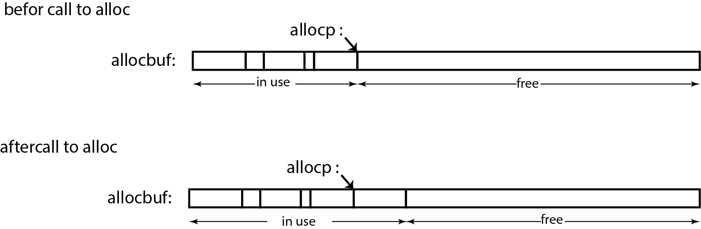
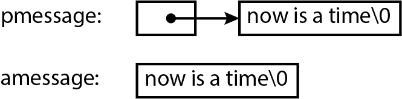

# Chapter 5:
# Pointers and Arrays

### Pointers and Addresses

If c is a char and p is a pointer:

<h1 align="center">
    
</h1>

The unary operator & gives the adress of an object

```c
    p = &c

    int x = 1, y = 2, z[10];
    int *ip;        /* ip is a pointer to int */

    ip = &x;        /* ip now points to x */
    y = *ip;        /* y is now 1 */
    *ip = 0         /* x is now 0 */
    ip = &z[10];    /* ip now points to z[0] */

    // Function

    atof(char *);

    // Operator

    *ip = *ip + 10;

    y = *ip + 1;

    *ip += 1;

    ++*ip;
    (*ip)++;

    iq = ip;
```

### Pointers and Function Arguments

```c
void swap(int *px, int *py)
{
    int temp;

    temp = *px;
    *px = *py
    *py = temp;
}
```

Example:

[getint](01-getint.c)

Exercices:

[ex 5.1](exercises/ex5-01.c)
[ex 5.2](exercises/ex5-02.c)

### Pointers and Arrays

<h1 align="center">
    
</h1>

pa[i] ⬄ *(pa + i)

Example:

[strlen](02-strlen.c)

### Adress Arithmetic

<h1 align="center">
    
</h1>

Exemple:

[alloc](03-alloc.c)
[strlen](04-strlen.c)

### Character Pointers and Function

A string constant, written as :

    "I am a string"

```c
    char amessage[] = "new is a time";  /* an array */
    char *pmessage = "now is the time"; /* a pointer */
```

<h1 align="center">
    
</h1>

Example:

[strcpy](05-strcpy.c)
[strcmp](06-strcmp.c)

Exercice:

[ex5.3](exercises/ex5-03.c)
[ex5.4](exercises/ex5-04.c)
[ex5.5](exercises/ex5-05.c)
[ex5.6](exercises/ex5-06.c)

### Pointer Arrays; Pointer to Pointers

* Process:

        Read all the lines of input
        sort them
        print them in order

[row sorter](07-pointer_pointer.c)

Exercice:

[ex5.7](exercises/ex5-07.c)

### Multi-dimensional Arrays

[date converter](08-date_converter.c)

### Initialization of Pointer Arrays

```c
/* mounth_name: return name of n-th mounth */
char *mounth_name(int n)
{
    static char *name[] = {
        "Illegal mounth",
        "January", "February", "March",
        "April", "May", "June",
        "July", "August", "September",
        "October", "November", "December"
    };

    retrun (n < 1 || n > 12) ? name[0] : name[n];
}
```

### Pointer vs Multi-dimensional Arrays

```c
int a[10][20];
int *b[10];
```

a[*row*][*col*] : 20 * *row* + *col*


### Command-line Arguments

```c
main(argc, *argv[])
```

[echo](09-echo.c)