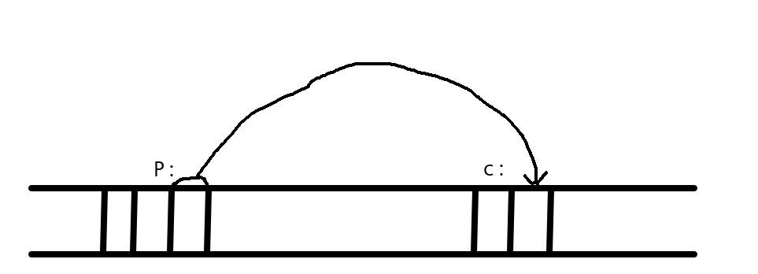
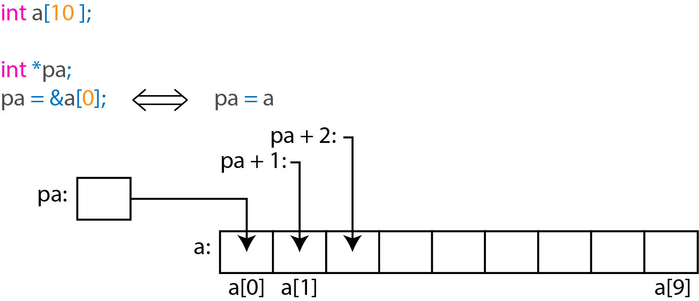

# Chapter 5:
# Pointers and Arrays

### Pointers and Addresses

If c is a char and p is a pointer:

<h1 align="center">
    
</h1>

The unary operator & gives the adress of an object

```c
    p = &c

    int x = 1, y = 2, z[10];
    int *ip;        /* ip is a pointer to int */

    ip = &x;        /* ip now points to x */
    y = *ip;        /* y is now 1 */
    *ip = 0         /* x is now 0 */
    ip = &z[10];    /* ip now points to z[0] */

    // Function

    atof(char *);

    // Operator

    *ip = *ip + 10;

    y = *ip + 1;

    *ip += 1;

    ++*ip;
    (*ip)++;

    iq = ip;
```

### Pointers and Function Arguments

```c
void swap(int *px, int *py)
{
    int temp;

    temp = *px;
    *px = *py
    *py = temp;
}
```

Example:

[getint](01-getint.c)

Exercices:

[ex 5.1](exercises/ex5-01.c)
[ex 5.2](exercises/ex5-02.c)

### Pointers and Arrays

<h1 align="center">
    
</h1>

pa[i] ⬄ *(pa + i)