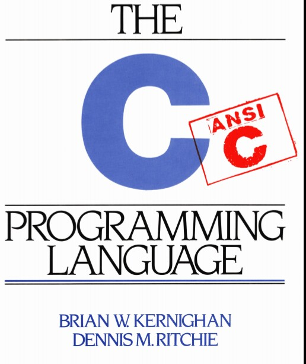

<h1 align="center">
    The C programming language
     
    
     
</h1>

My notes on the book The C programming language (ANSI C).

<h1 align="center">
     
    
     
</h1>

## Summary

[Chapter1: Introduction](Chapter1-Introduction)
    
1. Getting Stated 
1. Variables and Arithmetic Expressions
1. The For Statement
1. Symbolic Constants
1. Character Input and Output
1. Arrays
1. Functions
1. Arguments-Call by Value
1. Cahracter Arrays
1. External Varables and Scope

[Chapter2: Types operators Expressions](Chapter2-Types_operators_Expressions)

1. Variable Names
1. Data Types and Sizes
1. Constants
1. Delcarations
1. Arithmetic Operators
1. Relational and Logiacal Operators
1. Types Conversions
1. In crement and Decrement Operator
1. Bitwise Operator
1. Assignement Operator and Expressions
1. Conditional Expressions
1. Precedence and Order of Evaluation

[Chapter3: Control Flow](Chapter3-Control_Flow)

1. Statements and Blocks
1. If-Else
1. Else-if
1. Switch
1. Loops - While and For
1. Loops - Do-While
1. Break and Continue
1. Goto and Labels

[Cahpter4: Functions And Program Strucutre](Chapter4-Functions_And_Program_Strucutre)

1. Basics of Function
1. Functions Returning Non-Integers
1. External Varaibles
1. Scope Rules
1. Header Files
1. Static Varaibles
1. Register Variables
1. Block Structure
1. Initialization
1. Recursion
1. The C preprocessor

[Chapter5: Pointers and Arrays](Chapter5-Pointeurs_and_Arrays)

1. Pointers and Addresses
1. Pointers and Function Arguments
1. Pointers and Arrays
1. Address Arithmetic
1. Character Pointers and Functions
1. Pointer Array; Pointers to Pointer
1. Multi-dimensional Arrays
1. Initialization of Pointer Arrays
1. Pointers vs. Multi-dimensional Arrays
1. Command-line Arguments
1. Pointer to Functions
1. Complicated Declarations